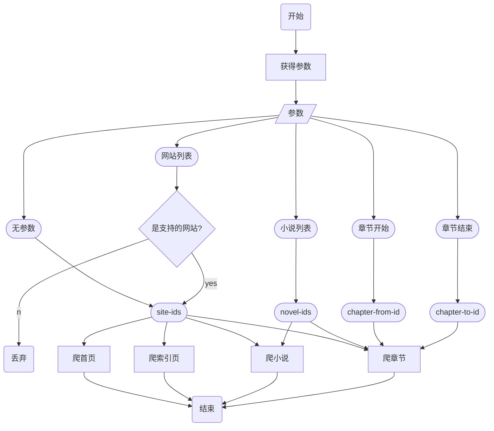
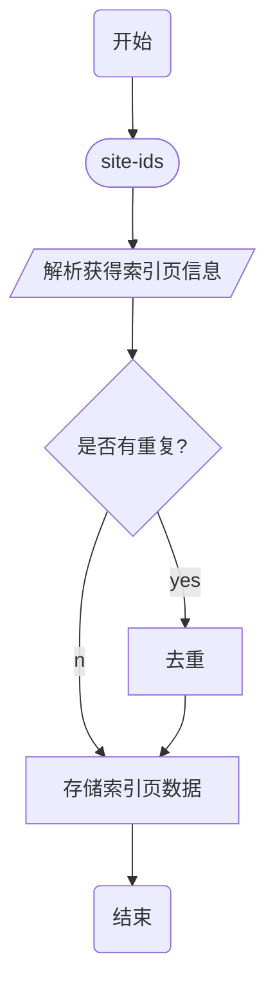
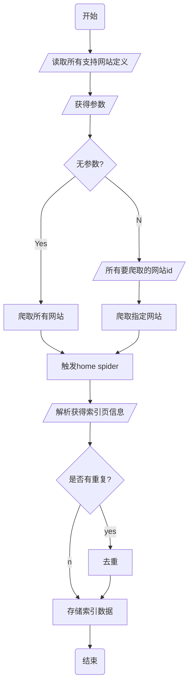

本文介绍，如何从零开始，一步一步的，利用Python及Scrapy创建一个可以抓取不同站点，可管理的爬虫。

# 背景

小明（小明你好）喜欢阅读网文，但网文往往很多广告不易阅读，并且他没有很多移动流量，
就想着在 WIFI 下载好了然后可以不用联网一直看，于是让我们来分析他的需求：

## 原始需求

* 因为不同的网文在不同的网站上，所以要能够从不同的网站上下载
* 能够搜索一本小说，并下载这本小说的所有章节，而这本小说下载后，能自动更新
* 下载的章节要能优化显示不要乱糟糟

## 需求分析

		年纪大了，懒得闲扯了，直接来具体的。。。


* 能爬不同小说站
  * 支持的小说站定义
* 能爬全站分类，小说，目录，每章 4 级页面
  * 每个站对应要定义这几级的规则
* 能搜索指定小说（两个方案，一个是网站自身的搜索，另外是百度搜素。百度搜索同时适合网站不提供搜索的情况）
  * 能解析搜索返回页面
* 能列出队列中的所有小说
* 能选择任一队列中的小说开始下载
* 可以指定某下载小说从N~M章节（不一定和页面能对上）开始下载
* 净化小说页面
  * 页面规则抽取
  * 使用净化库
* 设定能使用不同的间隔时间
* 设定能使用不同的IP（IP池）
* 当规则发生变化后，不再下载该网站，并报出问题


# 设计

从用例开始，综合考虑选型、数据库设计和架构设计。
因为已确定使用scrapy，所以以scrapy流程为基础来设计。

## 用例

*以下所说**开关触发**是指函数、命令行命令、数据库数据等各种方式，
具体看实现*

#### 爬取网站索引

使用一个开关触发爬虫，爬虫循环所有支持的网站，爬取其所有索引页，
将索引页上的小说及地址解析并存储

此开关支持参数：

* 无参数：爬取所有支持的网站
* 参数 `site_id`：爬取指定网站


#### 爬取小说目录（及信息）

使用一个开关触发爬虫，爬取已经存储的小说地址，从而获得小说目录（及信息），
并存储到数据库

此开关支持参数：

* 无参数：爬取所有已存储的小说信息
* 参数 `site_id`：爬取指定网站的所有已存储小说章节（及信息）
* 参数 `novel_id`：爬取指定的小说章节（及信息）

#### 爬取小说章节

使用一个开关触发爬虫，爬取已经存储的小说章节，解析内容并存储。
如果小说章节已经爬取过，则继续爬取后面的章节

此开关支持参数：

* 无参数：爬取所有已存储的小说的所有章节
* 参数 `site_id`：爬取指定网站的所有小说章节
* 参数 `novel_id`：爬取指定小说的所有章节
* 参数 `chapter_from_id`：从指定章节id开始
* 参数 `chapter_end_id`：爬取到指定章节id结束

#### 搜索小说

使用一个开关触发，搜索指定的小说，解析搜索结果页面，存储前N条结果
可选取其中某条为指定小说爬取
每次新的搜索清除前次结果

参数：
* 参数 `novel_name`：小说名
* 参数 `list`：列出所有返回值
* 参数 `clean`： 清除搜索结果
* 参数 `select_id`：选的结果id，该小说被加入要爬取队列


## 数据（数据库，缓存，文件等）

### 所有支持的网站的定义

我们首先需要一个地方来定义所有支持的网站，内容包括其网址，索引页、小说页、章节页的URL 格式，
以及其各种页面的解析规则，解析方式，需要的字段等meta信息。

如果将其存储在数据库中，不便于修改（还需要增加CRUD界面），所以直接用文件定义，格式用
JSON 均可，其结构和schema 定义如下：

* 存于 `${BASE_FOLDER)/sites` 目录下
* 每个网站定义一个文件
* 文件schema:

```json
{
  "title": "spider supported site schema",
  "type": "object",
  "properties": {
    "name": {
      "type": "string",
      "description": "site name"
    },
    "url": {
      "type": "string",
      "description": "site url"
    },
    "home": {
      "type": "string",
      "description": "path to home page. 'url'+'home'= home page url."
    },
    "patterns": {
      "type": "array",
      "description": "patterns to parse pages.",
      "items": [
        {
          "type": "object",
          "properties": {

          }
        }
      ]
    }
    "index": {
      "type": "string",
      "description": "index pages
    }
  }
}
```


* 记录每个网站的小说索引
* 记录所有的小说
* 记录一个小说所有章节
* 爬取冲突/重复的记录
* 分布式爬取时的锁
* 所有的小说封面图片


### 文件如何存储

需要数据库表吗，还是一个字段？或是规则作品名生成？

```
    DB_t_article_media = Table('article_media', meta,
                               Column('id', Integer, primary_key=True, autoincrement=True),
                               Column('aid', Integer, ForeignKey(DB_t_article.c.id, ondelete='CASCADE'), index=True),
                               Column('cid', Integer, index=True), # chapter id
                               Column('name', String(100)),     # media name w/o ext
                               Column('ext', String(20), index=True),  # media file extension. jpg, png, pdf... None)
                               Column('path', String(100)),     # local path w/o name
                               Column('type', String(10), index=True),     # album, file, ...
                               Column('field', String(50), index=True),     # origin replaced in what field
                               Column('var', String(50), )
                               Column('url', Text),     # origin url or None
                               Column('update_on', DateTime(timezone=True)),  # last updated datetime by the author
                               Column('timestamp', DateTime(timezone=True), default=get_timestamp,
                                      onupdate=get_timestamp),

                               UniqueConstraint('aid', 'name'),
                               schema=schema
                               )
```

自动生成文件名，使用 hash 及 hash 目录，还是 site/name，还是两者结合？


下载的文件如何替换？存数据库，原位置变量替换？变量如果被使用？


如何下载文件，schema 如何设计 plugin 如何设计 流程有何影响


封面和普通文件如何区分

#### 

## 流程（基于scrapy）

### 流程图

* 根据传入参数调用不同的爬虫并爬取不同内容



* 爬首页 (home spider)




* 从索引页爬取所有小说页




### Spider 

* 爬取网站首页获得索引页面的 Home Spider
* 爬取索引页面获得小说列表的 Index Spider
* 爬取小说页面和章节的 Novel Spider
* 爬取小说章节的 Chapter Spider

`scrapy` 预定义了很多类型的通用爬虫，如 `CrawlSpider`, `FeedSpider` 等，但都不适合
因此我们从最基本的 `Spider` 继承 开始。